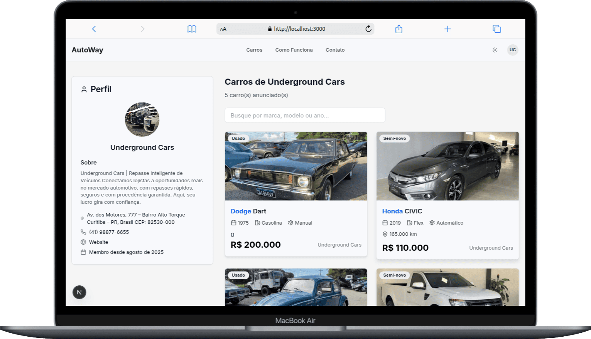

# Autoway

[](https://github.com/seu-usuario/autoway/actions)
[](./LICENSE)
[](#deployment)

## Overview

**Autoway** is a modern and efficient micro vehicle marketplace designed to facilitate connections between car sellers and buyers. Focused on simplicity and user experience, the project leverages modern JavaScript/TypeScript ecosystem technologies to create a robust, modular, and customizable platform.


---

## Deployment

> **Production environment:** [https://autoway.vercel.app](https://autoway.vercel.app)

---

## Stack and Technologies

- **Frontend & Fullstack:** [Next.js 15](https://nextjs.org/) (App Router, SSR/SSG, API Routes)
- **Language:** TypeScript
- **Styling:** [Tailwind CSS](https://tailwindcss.com/)
- **UI/UX:** [shadcn/ui](https://ui.shadcn.com/) (base components), Radix UI, Lucide, Lottie, Embla Carousel, Recharts
- **State management:** Zustand, React Query
- **Forms and validation:** React Hook Form, Zod
- **Authentication:** NextAuth.js, @auth/core, @next-auth/prisma-adapter
- **Database:** PostgreSQL (via Prisma ORM)
- **File/Image storage:** Cloudinary
- **Other:** Prisma, bcryptjs, clsx, immer, sonner, cmdk, react-icons


---

## Main Features

- 🚗 **Car registration, listing, and detailed views**
- 🔐 **User authentication (login/signup)**
- 👑 **Administrative area for user and car management**
- 📊 **Dashboard for authenticated users**
- 🖼️ **Image upload and management (Cloudinary)**
- 🔍 **Advanced search with filters** (brand, fuel type, transmission, condition, price, year)
- 👥 **User profiles (admin and regular)**
- ✅ **Data validation (Zod)**
- 📱 **Modern, responsive and accessible interface** (shadcn/ui, Radix UI, Tailwind)

---

## Permissions and Roles

The system has two types of users:

| Type                | Permissions                                                 |
| ------------------- | ----------------------------------------------------------- |
| **👤 Regular User** | Can register, edit and view their own cars and profile      |
| **👑 Admin**        | Full access to administrative panel and user/car management |

Routes and actions are protected according to user role, ensuring security and privacy.

---

## Authentication Flow

1. **Registration and login** via NextAuth.js (Prisma integration)
2. **Persistent session** (secure cookies)
3. **Protected sensitive routes** (Next.js middleware)
4. **Logout and profile updates**

---

## API Response Examples

### Example: List cars (GET `/api/cars`)

```json
{
  "cars": [
    {
      "id": "clx123...",
      "brand": "Toyota",
      "model": "Corolla",
      "year": 2022,
      "price": 120000,
      "transmission": "AUTOMATIC",
      "fuelType": "GASOLINE",
      "condition": "NEW",
      "user": {
        "id": "clxUser...",
        "name": "John",
        "isVIP": false
      }
    }
  ],
  "pagination": {
    "page": 1,
    "limit": 12,
    "total": 100,
    "pages": 9
  }
}
```

### Example: Authentication error

```json
{
  "error": "Unauthorized"
}
```

---



---

## Project Differentials

- ✨ **UI based on shadcn/ui and Radix UI**
- 🚀 **Ready for Vercel/Netlify deployment**
- ☁️ **Complete Cloudinary integration**
- 🏗️ **Modular and easy to maintain structure**
- 🔒 **Enhanced security** (headers, validation, permissions)
- 💻 **100% TypeScript code**

---

## Main Routes Table

| Route             | Method  | Protected | Description                    |
| ----------------- | ------- | --------- | ------------------------------ |
| /api/cars         | GET     | No        | List cars with filters         |
| /api/cars         | POST    | Yes       | Create new car (authenticated) |
| /api/user/[id]    | GET     | Yes       | User data                      |
| /api/user/[id]    | PATCH   | Yes       | Update profile                 |
| /api/auth/signin  | POST    | No        | Login                          |
| /api/auth/signup  | POST    | No        | Signup                         |
| /api/auth/session | GET     | Yes       | Query session                  |
| /api/admin/\*     | Various | Yes/Admin | Administrative routes          |

---

## Project Structure

```
├── app/                 # Pages, layouts, routes, controllers
│   ├── api/             # API routes (RESTful)
│   ├── admin/           # Administrative area
│   ├── dashboard/       # User panel
│   ├── cars/            # Car listing and details
│   ├── user/            # User profile
│   ├── ...              # Other pages and utilities
├── components/          # Reusable components (UI, layouts, domain)
│   ├── ui/              # Interface components (based on shadcn/ui)
│   ├── home/            # Home page sections
│   ├── cars/            # Car-specific components
│   ├── dashboard/       # Dashboard components
│   └── ...
├── hooks/               # Custom React hooks
├── lib/                 # Utility libraries (auth, prisma, cloudinary, validations)
├── prisma/              # Prisma database schema
├── public/              # Public assets (images, SVGs, animations)
├── stores/              # Zustand stores
├── styles/              # Global style files
├── types/               # Custom typings
├── utils/               # Utility functions
├── .env                 # Environment variables (NOT versioned)
├── package.json         # Dependencies and scripts
├── next.config.mjs      # Next.js configuration
├── tailwind.config.ts   # Tailwind configuration
├── tsconfig.json        # TypeScript configuration
└── ...
```

---

## Database (Prisma)

### Main Models

**Users, accounts, sessions, profiles**

**Cars:**

- Brand, model, year, price, transmission, fuel type, condition, mileage, description, images, features, owner user

**Enums:**

- Role (ADMIN, COMPANY)
- Transmission (AUTOMATIC, MANUAL)
- FuelType (GASOLINE, DIESEL, HYBRID, ELECTRIC, FLEX)
- Condition (NEW, USED, SEMI_NEW)

---

## Application Flow

1. **User accesses the platform** and can navigate, search and filter cars without login
2. **Registration/login** via NextAuth (with database integration via Prisma/PostgreSQL)
3. **Authenticated user** can register vehicles, edit profile, access dashboard
4. **Admin/company** has access to advanced features and inventory management
5. **Image uploads** are done via Cloudinary
6. **All critical actions** are protected by authentication and authorization
7. **RESTful APIs** (in `app/api/`) for CRUD operations on cars, users, profiles
8. **Notifications and feedback** are displayed via toasts and custom visual components

---


---

## Setup and Deploy

### 🚀 Installation

1. Clone the repository:

   ```bash
   git clone <repo-url>
   cd autoway
   ```

2. Install dependencies:

   ```bash
   yarn install
   # or npm install
   ```

3. Configure the `.env` file with necessary variables

4. Run database migrations:

   ```bash
   yarn prisma:migrate
   ```

5. Run the project in development:

   ```bash
   yarn dev
   ```

6. For build and production:
   ```bash
   yarn build && yarn start
   ```

---

## .env Example

> **Warning:** The values below are examples only. Never share real sensitive data publicly.

```env
DATABASE_URL="your_db_url"
DIRECT_URL="your_direct_db_url"
NEXTAUTH_SECRET="your_nextauth_secret"
NEXTAUTH_URL="http://localhost:3000"
NODE_ENV="development"
CLOUDINARY_CLOUD_NAME="your_cloudinary_cloud_name"
CLOUDINARY_API_KEY="your_cloudinary_api_key"
CLOUDINARY_API_SECRET="your_cloudinary_api_secret"
NEXT_PUBLIC_CLOUDINARY_CLOUD_NAME="your_cloudinary_cloud_name"
CLOUDINARY_UPLOAD_PRESET=your_upload_preset
```

---

## Available Scripts

| Script                 | Description                     |
| ---------------------- | ------------------------------- |
| `yarn dev`             | Start development server        |
| `yarn build`           | Generate production build       |
| `yarn start`           | Start server in production mode |
| `yarn prisma:migrate`  | Run database migrations         |
| `yarn prisma:generate` | Generate Prisma client          |
| `yarn prisma:deploy`   | Apply migrations in production  |

---

## Security Considerations

- 🛡️ **Security header policies** (CSP, HSTS, X-Frame-Options, etc)
- 🔐 **Sensitive variables kept in `.env`**
- ✅ **Robust validations with Zod**
- 🚦 **Route protection and permissions via NextAuth**

---


---

## shadcn/ui Components

The components in `components/ui/` are based on [shadcn/ui](https://ui.shadcn.com/), an open source collection of accessible, customizable React components integrated with Tailwind CSS.

**Advantages:**

- Fully customizable via Tailwind and design tokens
- Accessibility guaranteed by Radix UI
- Visual and UX standardization
- Easy maintenance and updates

> To add new components, use the shadcn/ui CLI according to the [official documentation](https://ui.shadcn.com/docs/installation).

---

## API Endpoints (Examples)

### Cars

**GET** `/api/cars`

- List cars with filters: `?page=1&limit=12&search=...&brand=...&fuelType=...`

**POST** `/api/cars`

- Requires authentication (bearer token/cookie)
- **Body example:**
  ```json
  {
    "brand": "Toyota",
    "model": "Corolla",
    "year": 2022,
    "price": 120000,
    "transmission": "AUTOMATIC",
    "fuelType": "GASOLINE",
    "condition": "NEW",
    "features": ["Airbag", "ABS"],
    "images": ["https://..."],
    "description": "New car, fully equipped."
  }
  ```

### User

- **GET** `/api/user/[id]` - User details (requires authentication)
- **PATCH** `/api/user/[id]` - Update profile data

### Authentication

- **POST** `/api/auth/signin` and `/api/auth/signup`
- **POST** `/api/auth/signout`
- **GET** `/api/auth/session` - Query current session

---

## Data Models (Prisma)

### User

```prisma
model User {
  id            String    @id @default(cuid())
  name          String?
  email         String    @unique
  password      String?
  phone         String?
  emailVerified DateTime?
  image         String?
  role          Role      @default(COMPANY)
  slug          String    @unique
  isVIP         Boolean   @default(false)
  accounts      Account[]
  sessions      Session[]
  profile       Profile?
  cars          Car[]
  createdAt     DateTime  @default(now())
  updatedAt     DateTime  @updatedAt
}
```

### Car

```prisma
model Car {
  id           String       @id @default(cuid())
  slug         String       @unique
  brand        String
  model        String
  year         Int
  price        Decimal
  transmission Transmission
  fuelType     FuelType
  condition    Condition
  mileage      Int?
  description  String?
  features     String[]
  images       String[]
  userId       String
  user         User         @relation(fields: [userId], references: [id], onDelete: Cascade)
  createdAt    DateTime     @default(now())
  updatedAt    DateTime     @updatedAt
}
```

### Profile

```prisma
model Profile {
  id          String   @id @default(cuid())
  userId      String   @unique
  user        User     @relation(fields: [userId], references: [id], onDelete: Cascade)
  bio         String?
  address     String?
  website     String?
  socialMedia Json?
  avatar      String?
  createdAt   DateTime @default(now())
  updatedAt   DateTime @updatedAt
}
```

### Enums

```prisma
enum Role { ADMIN COMPANY }
enum Transmission { AUTOMATIC MANUAL }
enum FuelType { GASOLINE DIESEL HYBRID ELECTRIC FLEX }
enum Condition { NEW USED SEMI_NEW }
```

---

## API Usage Examples

### Search cars (GET)

```bash
curl -X GET 'http://localhost:3000/api/cars?page=1&brand=Toyota'
```

### Create car (POST, authenticated)

```bash
curl -X POST 'http://localhost:3000/api/cars' \
  -H 'Content-Type: application/json' \
  -H 'Authorization: Bearer <token>' \
  -d '{
    "brand": "Toyota",
    "model": "Corolla",
    "year": 2022,
    "price": 120000,
    "transmission": "AUTOMATIC",
    "fuelType": "GASOLINE",
    "condition": "NEW",
    "features": ["Airbag", "ABS"],
    "images": ["https://..."],
    "description": "New car, fully equipped."
  }'
```

---


---

## License

Distributed under the [MIT](./LICENSE) license. You have permission to use, copy, modify, merge, publish, distribute, sublicense and/or sell copies of the software, provided that you preserve the original copyright notice.

[](./LICENSE)

---

For more information or contact, visit my GitHub profile.
